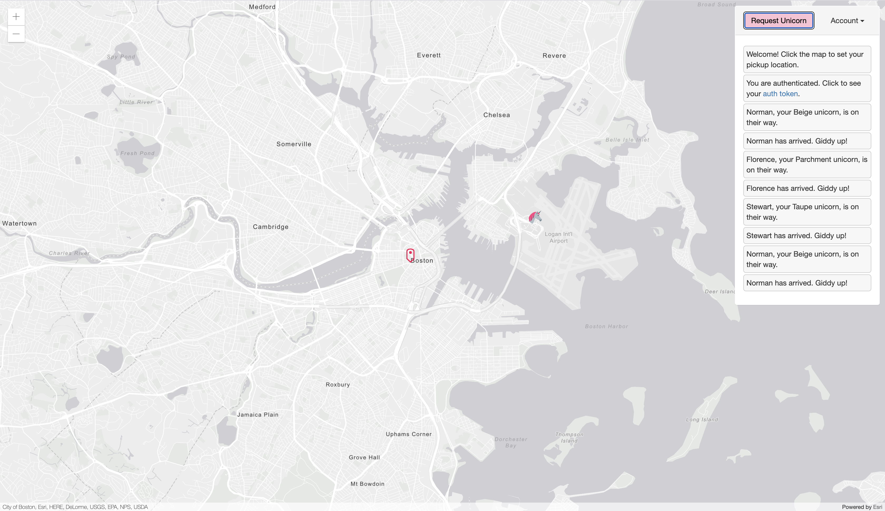
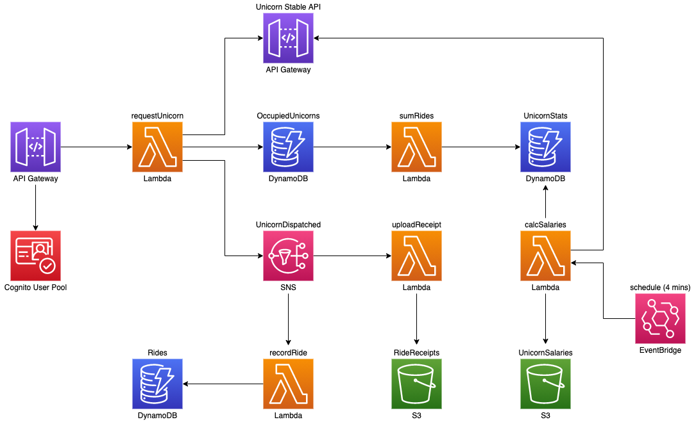
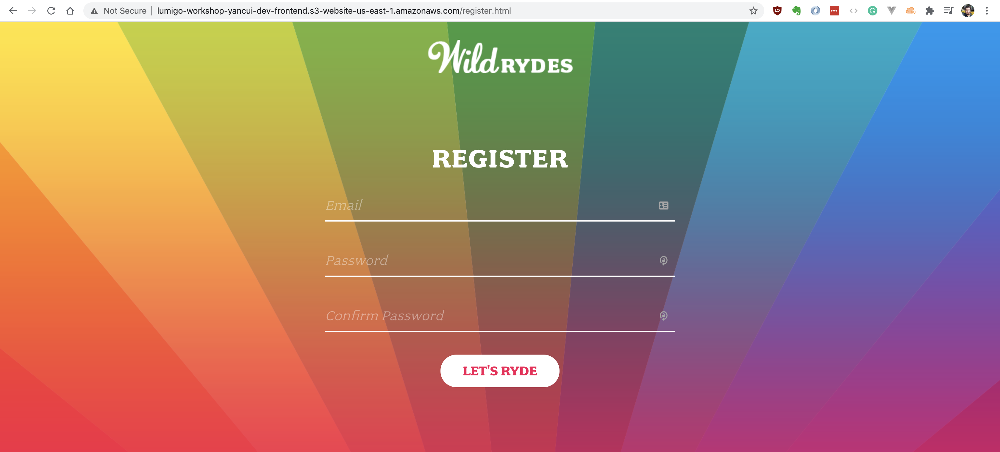
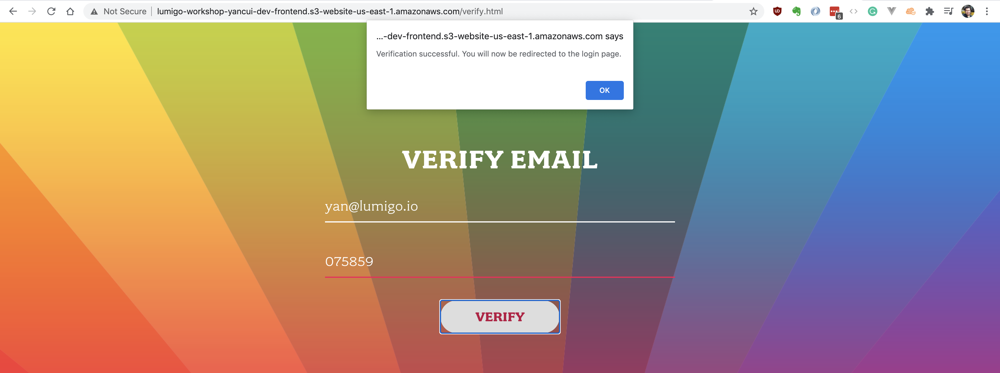
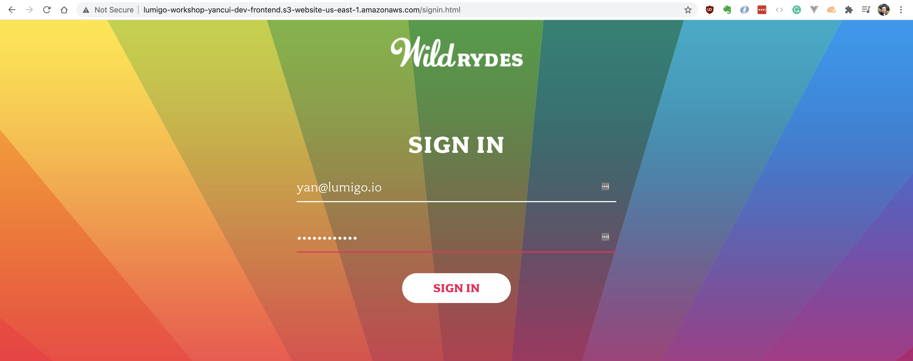
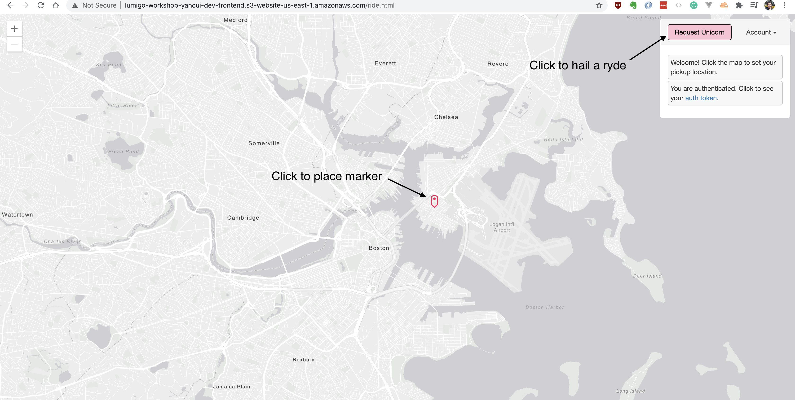
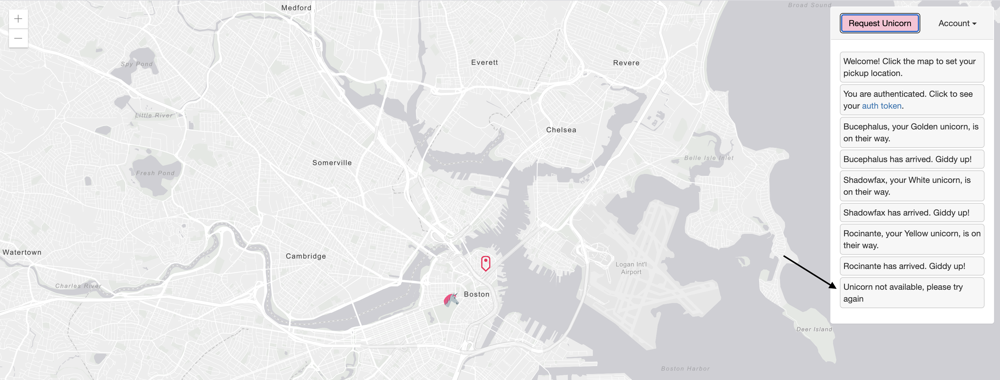

# Module 1 - deploying the Wild Rydes demo app

In this step of the workshop you will create and deploy the *Wild Rydes* demo app. The demo app lets you order rides from... unicorns!



The architecture for the demo app looks like this:



There's a user-facing API Gateway, and a single `POST /ride` endpoint (backed by the `requestUnicorn` Lambda function) to order a ride.

This `requestUnicorn` function would:

1. find available unicorns in the area, using an external API (`Unicorn Stable API`).

2. validate that the unicorn it found from step 1. is not occupied already by checking in the `OccupiedUnicorns` DynamoDB table.

3. publish details of the ride to the `UnicornDispatched` SNS topic.

These kick off a series of background processing tasks through both SNS and DynamoDB Streams.

We will use this demo app to demonstrate various problems you can run into in a production environment and how you can go about debugging them.

<details>
<summary><b>Clone the demo app repo</b></summary><p>

As a first step, we'll deploy the demo app to your AWS account and then see how we can debug different problems with Lumigo.

**RECOMMENDATION**: you shouldn't deploy this to your production AWS account. Use your personal account, or a playground account.

1. First, clone this repo locally:

`https://github.com/lumigo-io/troubleshooting-serverless-workshop-demo`

2. In the project folder, run `npm ci` to restore all project dependencies.

3. Open `serverless.yml`, and on line 10, replace `<INSERT YOUR NAME>` with your name.

4. In the project folder, run `npm run deploy-all`. This will deploy both the Serverless backend as well as the Wild Rydes frontend application.

The deployment process will take a couple of minutes, so let's talk about what's going on here.

This project is using the [Serverless framework](https://www.serverless.com/open-source/) to package and deploy both the frontend and backend.


5. At the end of the deployment you should see messages like this:

```
Serverless: This deployment will:
Serverless: - Upload all files from 'client/dist' to bucket 'lumigo-workshop-yancui-dev-frontend'
Serverless: - Set (and overwrite) bucket 'lumigo-workshop-yancui-dev-frontend' configuration
Serverless: - Set (and overwrite) bucket 'lumigo-workshop-yancui-dev-frontend' bucket policy
Serverless: - Set (and overwrite) bucket 'lumigo-workshop-yancui-dev-frontend' CORS policy
Serverless: Looking for bucket...
Serverless: Bucket found...
Serverless: Deleting all objects from bucket...
Serverless: Configuring bucket...
Serverless: Configuring policy for bucket...
Serverless: Retaining existing tags...
Serverless: Configuring CORS for bucket...
Serverless: Uploading client files to bucket...
Serverless: Success! Your site should be available at http://lumigo-workshop-yancui-dev-frontend.s3-website-us-east-1.amazonaws.com/
```

The URL at the end is where the frontend is hosted, go to it.


That's it, you've successfully deployed the Wild Rydes demo app!

</p></details>

<details>
<summary><b>Register and sign in</b></summary><p>

Unfortunately, there's no "Registration" button anywhere on the page, so you need to add `/register.html` to the end of the URL to open the registration page.



1. Register a new account.

2. Get the verification code from your registered email.



After you enter the verification code, you should be taken back to the sign-in page.

3. Sign in.



4. Wait a moment for the map to load, then click anywhere on the map to put down a marker. This is where you'll hail for a ryde.



5. Click `Request Unicorn`. If the request was successful, then you'll a see unicorn appear and arrive at your marker.

Do this several times, and you might see `Unicorn not available` because all the unicorns are busy.



And from time to time, nothing happens after you click `Request Unicorn` and then you get an error popup like this:


So, looks like there are a few problems in this app, let's find them!

</p></details>