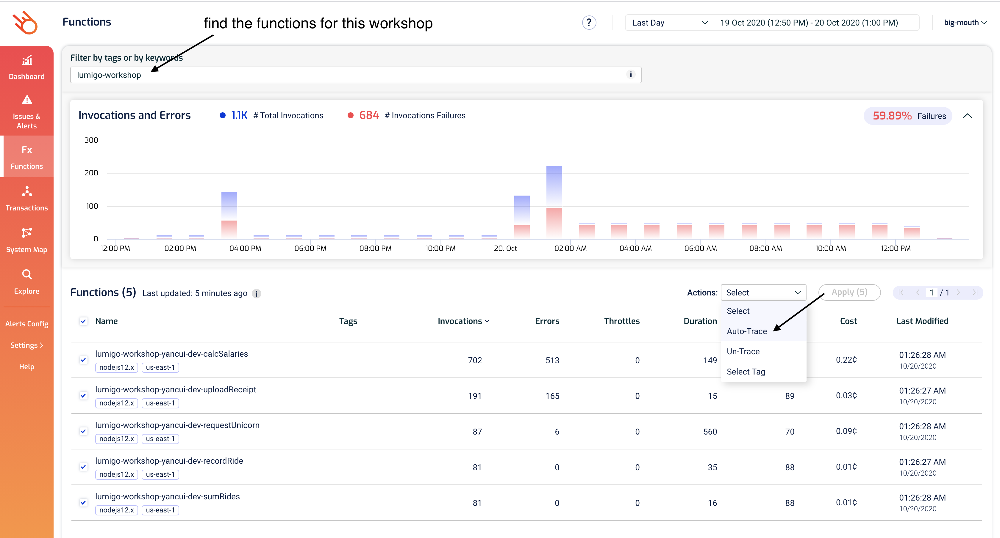
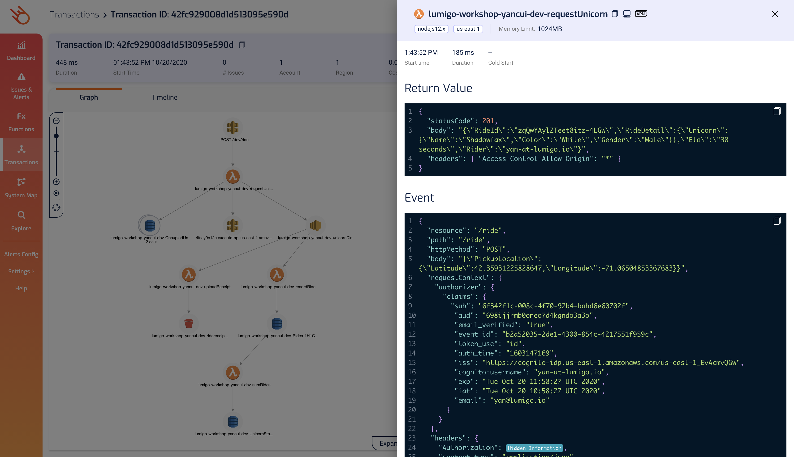

# Module 2 - serverless observability

In this module, you will integrate [Lumigo](https://lumigo.io) with the demo application.

<b>Integrate Lumigo into the app</b>

To get started with Lumigo, take the following steps. A more detailed guide can be found at [the Lumigo documentation](https://docs.lumigo.io/docs/create-an-account).

1. Head over to https://platform.lumigo.io/signup and sign up for an account

2. Once you created your account, Lumigo will guide you through the integration. First, fill in some details.

3. Next, we will link Lumigo to our AWS account. To do so all that is required is to deploy its CloudFormation stack to your account. A more detailed walkthrough of this step can be found [here](https://docs.lumigo.io/docs/connect-your-environment)

4. You should land at the instrumentation step, which will let us choose functions to trace:

You can also do this after the initial setup too. Just head over to the [Functions](https://platform.lumigo.io/functions) page at any time, and you can auto-trace any function there:

Once you added tracing to the relevant Lambda functions, Lumigo will automatically start monitoring your application.

5. Order some unicorn rides, and let's see what's going on in Lumigo!

<b>Viewing your application in Lumigo</b>

Lumigo will trace the invocations of your application. The first thing we will use it for is to get an understanding of how our application looks in real life.

1. Click on the [System map](https://platform.lumigo.io/system-map) to have an overview of your application's architecture:

Notice how this is identical to the architecture diagram we drew by hand, except it's drawn from the actual invocations that Lumigo has traced, so it's **always up-to-date** and based on actual data.

2. Explore the different functions' stats and invocations in your account using the [Functions](https://platform.lumigo.io/functions) page:

3. Click into any of the functions to get more details on it:

Clicking on the `Metrics` tab would show you some additional metrics like the number of cold starts as well as cold start durations.

4. Also, don't forget to check out the [Transactions](https://platform.lumigo.io/transactions) page to see the recent transactions that Lumigo has traced:

5. In this page, if you click on one of the transactions then you can see what happened on that transaction alongside the logs for all the participating functions. Click on one of the transactions that started with the `requestUnicorn` function and you should see something like this:

6. If you click on any of the icons in the graph, you can see even more information about that resource, including any request and response to and fro the resource. For example, if you click on the `requestUnicorn` function, you should see its return value, invocation event, environment variables and its logs:

Similarly, if you click on the `unicornDispatched` SNS topic, you will see the `sns.Publish` request that `requestUnicorn` function made to it. Notice that sensitive data like API keys and auth tokens are scrubbed and were never sent to Lumigo's backend in the first place.

Where a resource was accessed multiple times during a transaction, you can also iterate through all the individual requests too. For example, the `requestUnicorn` function did a `dynamodb.Get` and then `dynamodb.Put` against the `OccupiedUnicorns` table:

Having all these information at your fingertips makes it easy for you to understand what **actually happened** during this transaction without spraying your code with manual instrumentation code!

7. One final thing, click on `Timeline` shows you where the time was spent on this transaction to help you identify culprits when performance issues arise.

Now that you know your way around Lumigo, let's use it to troubleshoot the issues we are seeing in the demo app.

