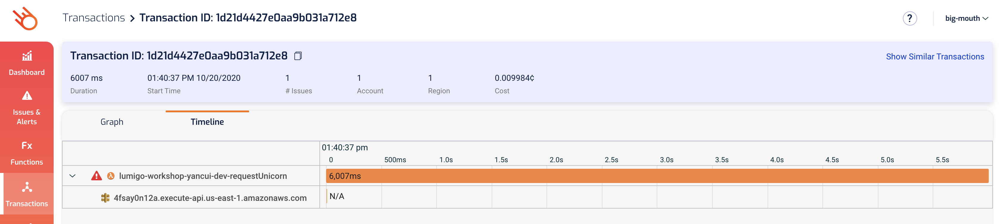

# Module 3 - troubleshooting with Lumigo

In this module, we'll use Lumigo to troubleshoot the issues in the demo app.

If you go to the [Issues & Alerts](https://platform.lumigo.io/issues) page and you will see at a glance all the issues that Lumigo has identified in your environment.

<b>Troubleshoot timeouts (requestUnicorn)</b>

1. If you click on the `Timeout` issue for the `requestUnicorn` function, it will take you to the function details page for the function and show you the invocations that timed out.

2. Click on one of the timed out transactions to see what happened in that transaction.

3. From the function logs, you can see a message like `2020-10-20T11:40:37.402Z	3ea3b770-2986-4926-a0b3-2c6a045bfa20	INFO	Finding unicorn for  42.34963749150315 ,  -71.05718295574066`

and then 6 seconds later, the invocation timed out.

4. Click on the `Timeline` tab and you will see that the request to `4fsay0n12a.execute-api.us-east-1.amazonaws.com` never completed, hence the `N/A`. So this was the cause for the invocation timing out.

<b>Troubleshoot timeouts (calcSalaries)</b>

1. Go to back the [Issues & Alerts](https://platform.lumigo.io/issues) page and you'll see that the `calcSalaries` function has also timed out a few times. As before, click on the `Timeout` issue for `calcSalaries` and see the timed out invocations.

2. Click on one of the timed out transactions to see what happened.

3. Unfortunately, there's nothing in the logs to indicate what happened. But let's click on `Timeline` tab to see what happened.

<b>Troubleshoot business logic errors (uploadReceipt)</b>

1. Go to back the [Issues & Alerts](https://platform.lumigo.io/issues) page and you'll see that the `uploadReceipt` function has thrown a few `TypeError`. 

As before, click on the row to see the invocations.

2. Click on one of the transactions to see what happened.

3. In this transactions view, you can see that whole transaction starting from the original request to find a unicorn. You can see the `uploadReceipt` function being highlighted as where the problem is. Since SNS is an async event source for Lambda, these failed invocations are retried automatically. From the overlapped Lambda icon (and the fact that it says `3 retries`), you can tell that this invocation was indeed retried, but still failed.

4. Click on the `uploadReceipt` function's icon to see more details about these invocations.

Well, we see the error `Cannot read property 'Name' of undefined` and probably have some suspicion as to what it might be - maybe the SNS message is missing properties.

To find evidence to support our hypothesis, let's look for a successful invocation and compare that with this.

5. Click `Show Similar Transactions` on the top right.

As you can see, a lot of the transactions had a `TypeError`, we're looking for a successful transaction without any issues.

6. Click on one of the successful transaction.

7. Click on the `uploadReceipt` function to bring up its details. One thing that jumps out is that the SNS message contains an object in `RideDetail` which has a `Name` property.

contrast that with the failed invocation, which complained about being to read `Name` of `undefined`:

So there's the problem. Looking at the code for `uploadReceipt` confirms this:

