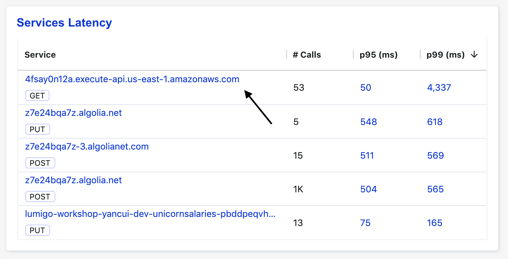

# Module 4 - debugging performance issues

In this module, we'll see how you can identify slow dependencies and debug slow Lambda invocations.

1. Go to the [Dashboard page](https://platform.lumigo.io/dashboard), and have a look at the `Service Latency` widget at the bottom right. This shows you the tail latency for serivces that you are calling from your Lambda functions.

2. By default, this widget is sorted by the `p95 (ms)` column. Somewhere amongst the top, you might see `4fsay0n12a.execute-api.us-east-1.amazonaws.com` up there, by either `p95 (ms)` or `p99 (ms)`.

3. Click on the p99 latency value (4337 in my case)

This takes you to the [Explore page](https://platform.lumigo.io/search) with a prefilled query that finds the transactions where this service was involved and recorded a latency that's equal to or greater than the latency value you clicked on.

4. Click on one of these transaction to see what happened.

In this transaction, you can see that we made 3 calls to `4fsay0n12a.execute-api.us-east-1.amazonaws.com`.

5. Click on the `Timeline` tab and you will see that one of the requests to `4fsay0n12a.execute-api.us-east-1.amazonaws.com` took 4345ms.

6. Click on the slow HTTP request, and see that the response was for `Rocinante`.

7. Go back to the [Explore page](https://platform.lumigo.io/search) and find other transactions where `4fsay0n12a.execute-api.us-east-1.amazonaws.com` had been slow. See if you can spot any commonalities to these slow requests.
