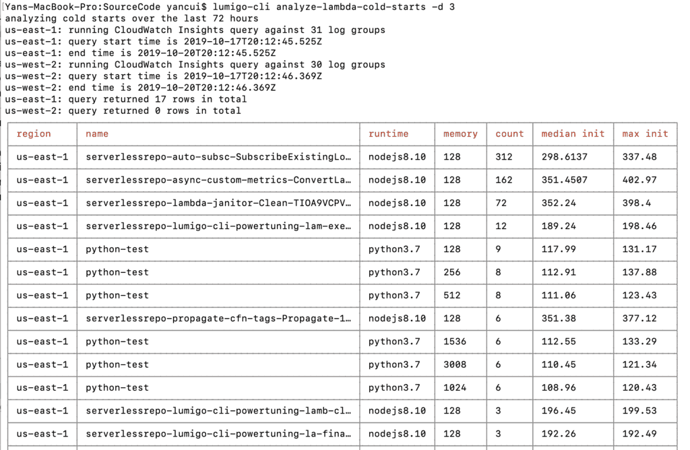

# Module 4 - debugging performance issues

In this module, we'll see how you can identify slow dependencies and debug slow Lambda invocations.

1. Go to the [Dashboard page](https://platform.lumigo.io/dashboard), and have a look at the `Service Latency` widget at the bottom right. This shows you the tail latency for serivces that you are calling from your Lambda functions.

2. By default, this widget is sorted by the `p95 (ms)` column. Somewhere amongst the top, you might see `4fsay0n12a.execute-api.us-east-1.amazonaws.com` up there, by either `p95 (ms)` or `p99 (ms)`.

3. Click on the p99 latency value (4337 in my case)

This takes you to the [Explore page](https://platform.lumigo.io/search) with a prefilled query that finds the transactions where this service was involved and recorded a latency that's equal to or greater than the latency value you clicked on.

4. Click on one of these transaction to see what happened.

In this transaction, you can see that we made 3 calls to `4fsay0n12a.execute-api.us-east-1.amazonaws.com`.

5. Click on the `Timeline` tab and you will see that one of the requests to `4fsay0n12a.execute-api.us-east-1.amazonaws.com` took 4345ms.

6. Click on the slow HTTP request, and see that the response was for `Rocinante`.

7. Go back to the [Explore page](https://platform.lumigo.io/search) and find other transactions where `4fsay0n12a.execute-api.us-east-1.amazonaws.com` had been slow. See if you can spot any commonalities to these slow requests.

## What about cold starts?

Ah, yes, the dreaded Lambda cold starts! So often the cause of many performance concerns, especially for user-facing API functions.

If you go to the [Functions page](https://platform.lumigo.io/functions) and navigate to any of your function, you can see information about that function's cold starts in the `Metrics` tab.

When you have lots of functions, it's not feasible to go through each functions individually. In the [Dashboard](https://platform.lumigo.io/dashboard) you can use the `Functions with most Cold Starts` widget to quickly identify problematic functions.

User-facing functions, such as those behind API Gateway, are often latency sensitive. In some cases, you may wish to use [Provisioned Concurrency](https://lumigo.io/blog/provisioned-concurrency-the-end-of-cold-starts/) to eliminate cold starts altogether. For instance, when you have really strict latency requirements, or if you're using JVM/.Net Core runtimes and cannot optimize your code any further to keep cold start duration under an acceptable latency range.

In some really unfortunate cases, cold starts can also stack up when one API function calls another (via API Gateway) and can cause further delays. You can easily spot these cases in the [Transactions page](https://platform.lumigo.io/transactions), by looking at the `Cold Starts` column.

If this happens frequently, then it might also be a good reason to use Provisioned Concurrency. Maybe one cold start of a few hundred milliseconds is acceptable, but when a few of them stack up on a single transaction, that can result in noticeable delays to users.

Finally, you can alos use the [lumigo-cli](https://www.npmjs.com/package/lumigo-cli), our open source CLI tool, and run the [analyze-lambda-cold-starts command](https://www.npmjs.com/package/lumigo-cli#lumigo-cli-analyze-lambda-cold-starts) to analyze the cold start performance for all your functions in an AWS account.

