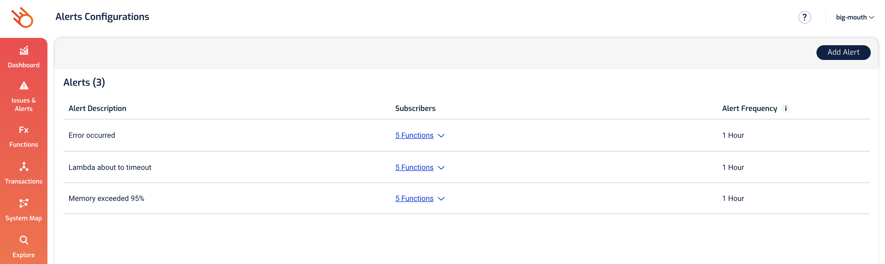
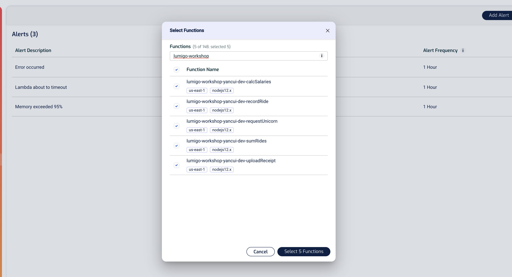
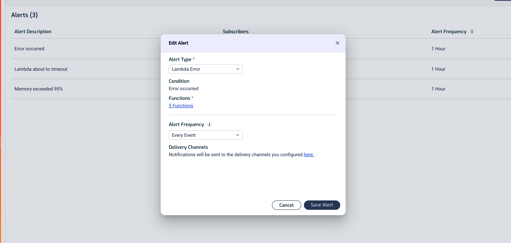
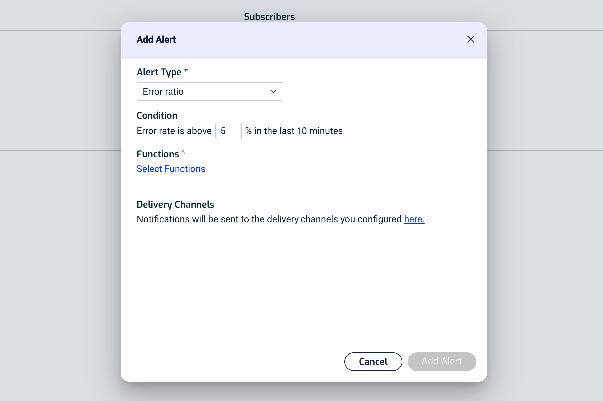
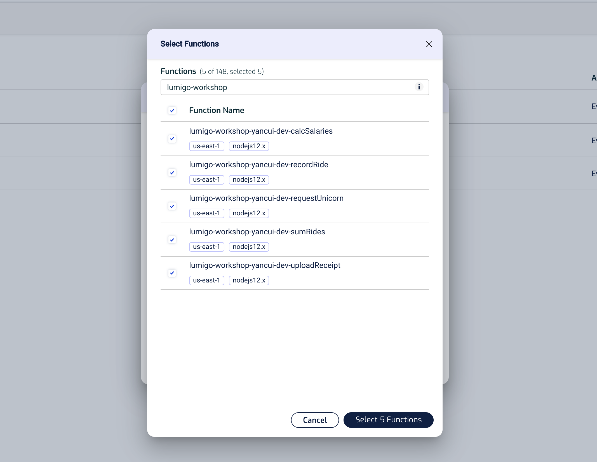
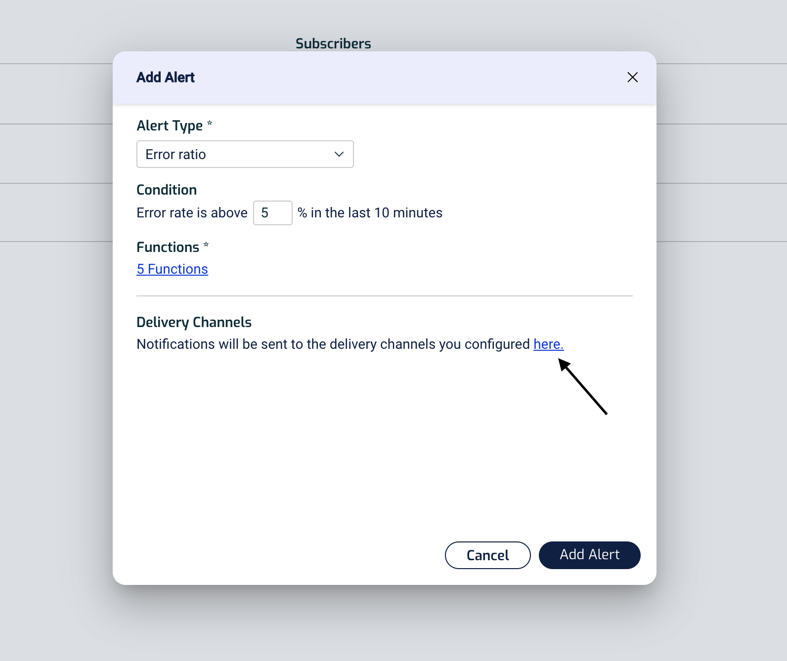
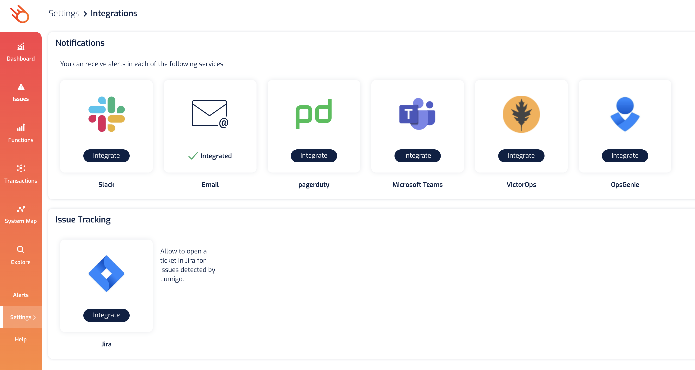
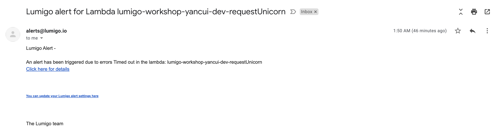

# Module 5 - alerting

In this module, we'll set up alerts in Lumigo.

1. Go to the [Alerts](https://platform.lumigo.io/alerts-configurations) page, you can see that Lumigo has configured a couple of default alerts.

By enabling `auto-trace` on our functions, they have been configured with these default alerts.

By default, they're configured to send you at most one alert per hour. You can dial this up or down (up to as frequent as to alert you on `Every Event`).

2. Click on each of the alerts and change the `Alert Frequency` in the dialogue to `Every Event`. Don't forget to click `Save Alert` when you're done.

3. Let's add another alert, click the `Add Alert` button on the top right. In the new dialogue, choose `Alert Type` as `Error Ratio` and set the percentage to 5%.

Select the 5 functions we have.

Finally, choose how we want to be notified. If you follow the `here` link below...

you will arrive at the [Integrations](https://platform.lumigo.io/integrations) page where you can integrate with other vendor software you might be using already.

Finally, click `Add Alert` to finish the process.

4. Go back to the demo app, request a bunch of unicorns like you did earlier. You should see errors, and sure enough, a short while later you will receive an alert via the medium you configured:

