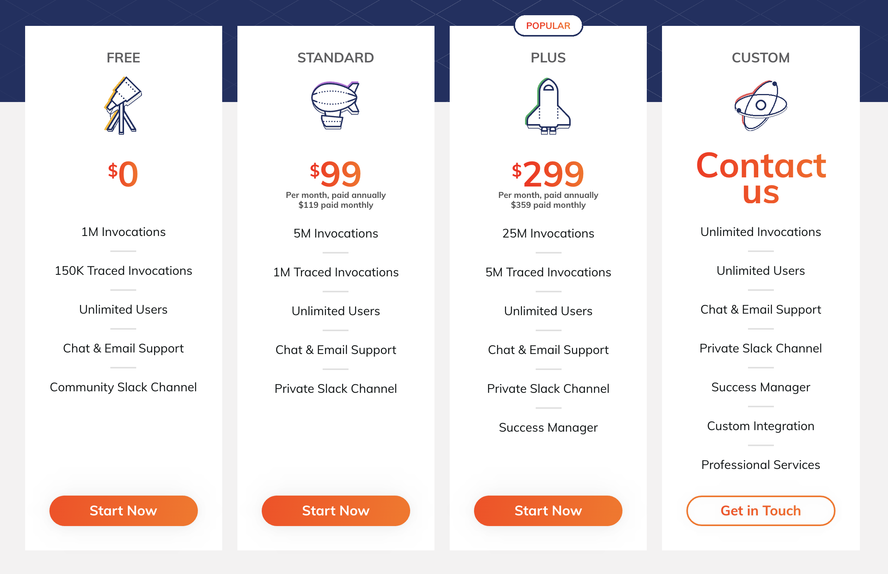
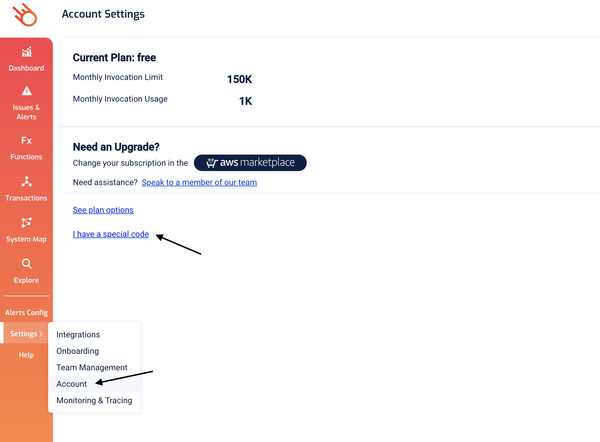
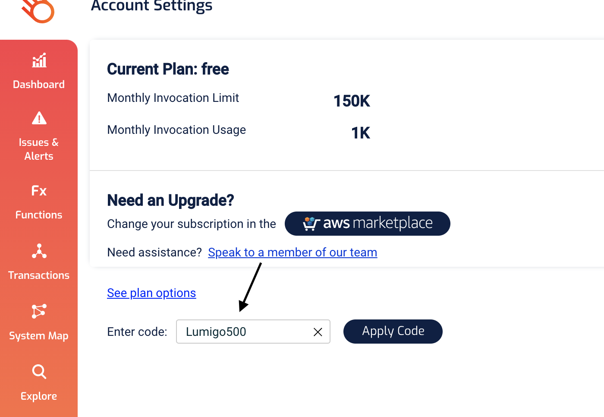
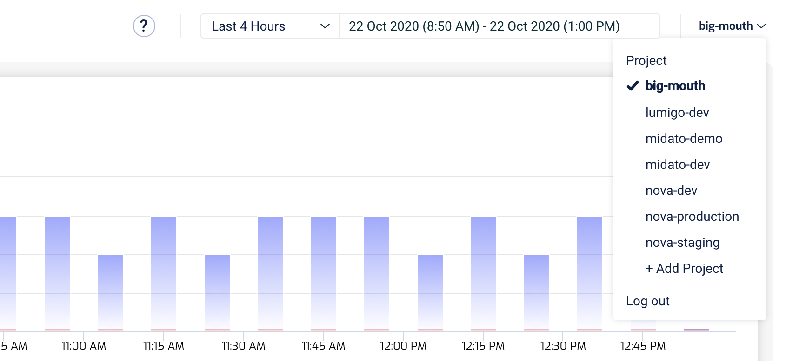
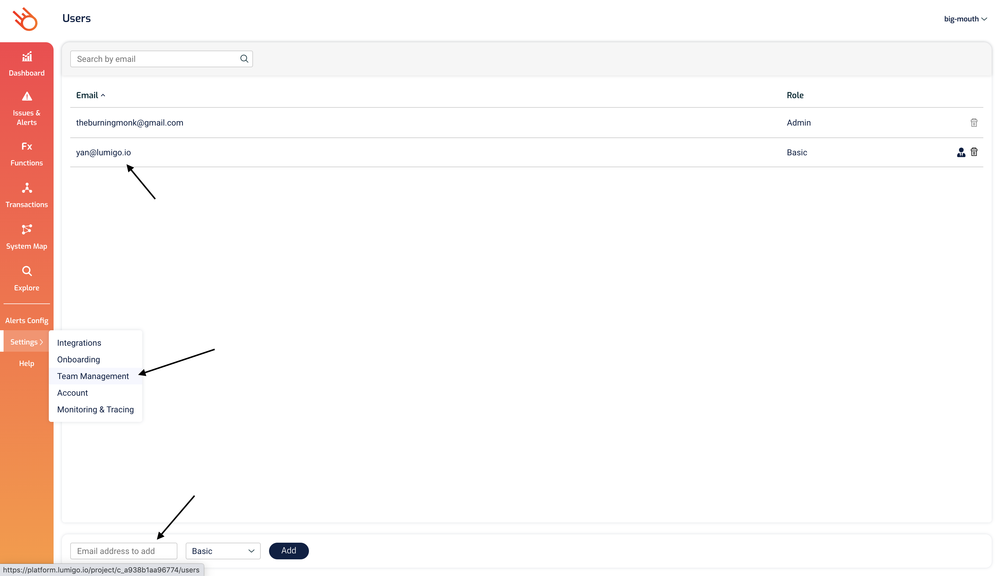
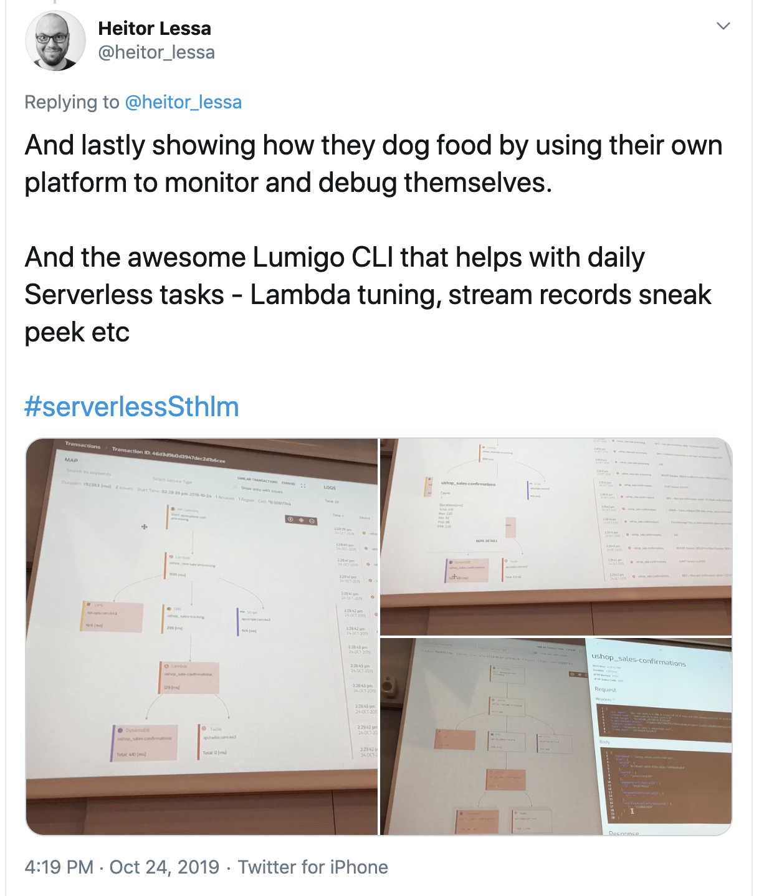

# Module 6 - next steps

I hope you have enjoyed these exercises and got a feel of how easy it can be to debug serverless applications with Lumigo.

For a chance to win a XBox Series X and to try out Lumigo for real, please raise your hand and join one of our breakout rooms for a 1-2-1 session to help you integrate Lumigo with your production accounts to see what insights Lumigo can give you.

There is a generous [free tier](https://lumigo.io/pricing) where you can trace up to 150,000 Lambda invocations a month for free.

Which means you can pretty much trace your dev accounts for free, and maybe even your production accounts, until you have sufficient amount of traffic.

And if you apply the code `Lumigo500`, under `Settings` -> `Account` -> `I have a special code`, then you can bump that free up to 500,000 traced invocations per month!

## What if I have more than 1 AWS account?

No problems. You can manage multiple accounts (we call them `projects`) with your Lumigo user, and you can quickly switch between different projects with the `Project` drop-down at the top right corner of the screen.

## How do I control who has access to the Lumigo platform?

You can do that in the [Team Management page](https://platform.lumigo.io/users). `Basic` role lets you view and query data in the Lumigo platform. `Admin` role lets you change configurations (e.g. alert configs).

For more information, please visit the Lumigo [docs](https://docs.lumigo.io/docs).

# lumigo-cli

Besides the core Lumigo platform, we also have a number of popular open source tools you can use for free.

The most important of which is the [lumigo-cli](https://www.npmjs.com/package/lumigo-cli), a CLI tool that simplifies a lot of your daily serverless tasks, e.g.

* powertuning a Lambda function to right-size its memory setting

* analyze Lambda cold starts

* analyze Lambda costs

* replay SQS messages from a DLQ to SQS/SNS/Kinesis

* tail events in SNS/SQS/Kinesis/DynamoDB/EventBridge

* tail CloudWatch logs

* switch between AWS CLI profiles

